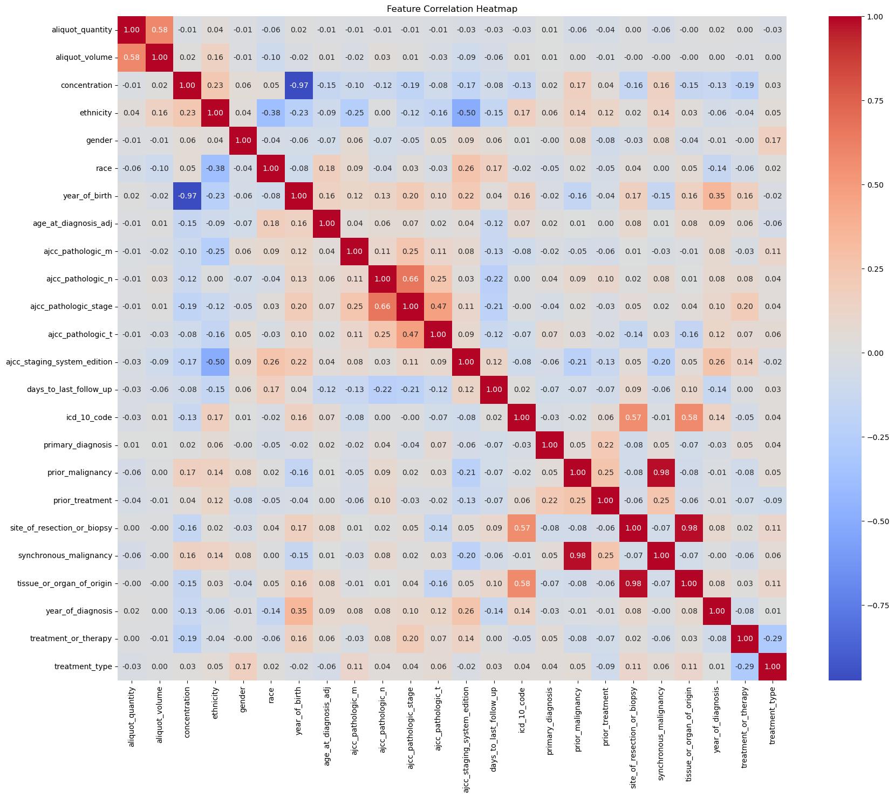

# Clinical Predictive Analytics Project

## Overview

This project demonstrates an applied predictive analytics workflow using clinical data. The goal of the project is to analyze structured clinical variables, perform exploratory data analysis, prepare the dataset for modeling, and evaluate predictive models for a healthcare-related decision-support use case.

This repository is included as portfolio evidence of Python, Jupyter Notebook, data preprocessing, exploratory analysis, data visualization, and predictive modeling skills.

## Project Objectives

* Clean and prepare structured clinical data for analysis.
* Explore relationships between clinical and demographic variables.
* Visualize patterns using charts and heatmaps.
* Build and evaluate predictive models.
* Communicate findings through a reproducible Jupyter Notebook workflow.

## Tools and Libraries

* Python
* Jupyter Notebook
* pandas
* NumPy
* scikit-learn
* matplotlib
* seaborn
* TensorFlow

## Repository Contents

| File                                  | Description                                           |
| ------------------------------------- | ----------------------------------------------------- |
| `clinical_predictive_analytics.ipynb` | Main Jupyter Notebook containing the project workflow |
| `clinical.py`                         | Supporting Python script                              |
| `clinical.csv`                        | Clinical dataset used for analysis                    |
| `bins.csv`                            | Supporting binned data file                           |
| `Heatmap.png`                         | Example visualization generated from the analysis     |

## Sample Visualization

## Methods Summary

The project workflow includes:

1. Data loading and inspection
2. Data cleaning and preprocessing
3. Exploratory data analysis
4. Feature preparation
5. Predictive model development
6. Model evaluation and interpretation

## Relevance

This project demonstrates skills relevant to data analytics and digital work, including structured data analysis, Python-based analytics workflows, visualization, and predictive modeling. It complements my business intelligence and dashboarding work by showing experience with more technical predictive analytics methods.

## View the Full Notebook

[Open the full Jupyter Notebook](./clinical_predictive_analytics.ipynb)
